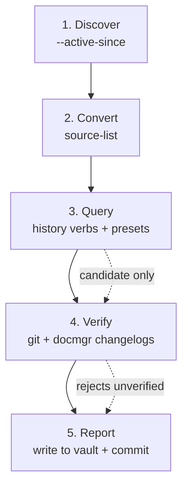

# Daily Log

## Purpose

Produce an evidence-backed daily work report from coding-agent session transcripts. The report answers one question: what work happened on a target day, across every repository, driven by every agent session that was active that day — across Pi, Codex, and Claude Code.

The report is grounded in verifiable evidence, not transcript text. Commit counts come from repository git history. Ticket progress comes from docmgr changelogs. File and ticket timelines come from converted minitrace archives. Every claim is cross-checked against external state before it is reported.

## When to use this skill

Use when the user asks for any of:

- "daily report" / "daily log" for a day
- "what did I do yesterday" / "what happened the day before"
- "summarize yesterday's work" / "summarize a day's coding-agent work"
- "create a daily report and store it in the obsidian vault"

This skill depends on the `go-minitrace-transcript-analysis` skill. Load that skill's `SKILL.md` for the full query-engine reference. This skill is the daily-report workflow layered on top of it.

## Required tools

- `go-minitrace` CLI (discover, convert, query)
- `git` (for commit verification)
- `docmgr` (ticket workspaces live on disk; changelogs are read directly)
- The Obsidian vault at `/home/manuel/code/wesen/go-go-golems/go-go-parc`

## The five-stage pipeline

Each stage produces a hypothesis. The next stage confirms or rejects it. Never skip the verification stage.



### Stage 1: Discover candidate sessions

Establish the target day and the current wall-clock time first:

```bash
date --iso-8601=seconds
```

Use `--active-since` (not `--since`) to find sessions that recorded activity in the window. `--active-since` recovers spanning sessions that started earlier and continued working on the target day. `--since` only matches start time and misses them.

```bash
TARGET_DAY="2026-07-19"

go-minitrace discover pi \
  --source-dir ~/.pi/agent/sessions \
  --active-since "$TARGET_DAY" \
  --output json > ./pi-discovery.json

go-minitrace discover codex \
  --source-dir ~/.codex \
  --active-since "$TARGET_DAY" \
  --output json > ./codex-discovery.json

go-minitrace discover claude-code \
  --source-dir ~/.claude/projects \
  --active-since "$TARGET_DAY" \
  --output json > ./claude-code-discovery.json
```

Each candidate record has `cwd`, `id`, `started_at`, `last_activity_at`, and `source_path`. Filter to sessions whose activity overlaps the target day. Sessions that started the *next* day are not part of the target day's work — exclude them before conversion.

Claude Code sessions live under `~/.claude/projects`. The adapter prefers JSONL v2 transcripts and ignores subagent transcripts at the discovery layer.

### Stage 2: Convert to archives

Create a self-contained investigation directory. Save the source list as an artifact so the conversion is reproducible.

```bash
INVEST_DIR="scripts/$(date +%Y/%m/%d)/daily-report-$(date -d "$TARGET_DAY" +%Y-%m-%d)"
mkdir -p "$INVEST_DIR"/{archives,queries,results}

# Write one path per line to a source list (all three frameworks)
for f in pi-discovery.json codex-discovery.json claude-code-discovery.json; do
  grep -o '"source_path": "[^"]*"' "$f" \
    | sed 's/"source_path": "//;s/"$//'
done | sort -u > "$INVEST_DIR/sources.txt"

go-minitrace convert pi \
  --source-list "$INVEST_DIR/pi-sources.txt" \
  --output-dir "$INVEST_DIR/archives/pi"

go-minitrace convert codex \
  --source-list "$INVEST_DIR/codex-sources.txt" \
  --output-dir "$INVEST_DIR/archives/codex"

go-minitrace convert claude-code \
  --source-list "$INVEST_DIR/claude-code-sources.txt" \
  --output-dir "$INVEST_DIR/archives/claude-code"
```

If a source list causes preflight failures (`missing native session ID`), pass the relevant sessions explicitly with repeatable `--source-session` flags. Let preflight failures surface bad inputs; do not suppress them.

Never modify native session files. Conversion copies a normalized representation into the investigation directory.

### Stage 3: Query the normalized tables

The query engine builds a SQLite database from archive globs automatically. There is no separate import step.

#### Overview: the session-list preset

```bash
GLOB="$INVEST_DIR/archives/*/active/*/*.minitrace.json"

go-minitrace query run \
  --archive-glob "$GLOB" \
  --preset session-list
```

This gives the skeleton: session IDs, frameworks, models, titles, turn counts, and tool-call counts. It does not show what was accomplished.

#### File timelines: the file-history verb

```bash
go-minitrace query commands history file-history \
  --archive-glob "$GLOB" \
  --path '<repo-path-fragment>' \
  --output json > "$INVEST_DIR/results/file-history-<repo>.json"
```

Each record reports `first_op`, `first_seen`, `last_seen`, and counts of creates/modifies/reads. This is candidate evidence that a file was the focus of work. Run this once per repository path fragment discovered in stage 1.

#### Ticket timelines: the ticket-timeline verb

```bash
go-minitrace query commands history ticket-timeline \
  --archive-glob "$GLOB" \
  --ticket '<TICKET-FRAGMENT>' \
  --output json > "$INVEST_DIR/results/ticket-<id>.json"
```

The `changelog_edits` array is the most useful for a daily report. Each entry has a `timestamp`, `session_id`, `turn_index`, and `detail`. Filter entries to the target day to get a chronological list of recorded completed work.

#### Time-window limitation

The `file-history` verb does not accept `--since`/`--until` flags. It returns the full history across converted archives. For spanning sessions, timestamps may fall on adjacent days. Treat file-history output as candidate evidence and verify against git (stage 4).

### Stage 4: Verify against external state

Query output is candidate evidence, not proof. Verify every claim against git and docmgr before reporting it.

#### Git verification

For each repository a session touched, query the git log for the target window:

```bash
git -C "$REPO" log \
  --since="$TARGET_DAY 00:00:00" \
  --until="$TARGET_DAY 23:59:59" \
  --date=short --pretty='%h %ad %s'
```

Count the commits:

```bash
git -C "$REPO" log \
  --since="$TARGET_DAY 00:00:00" \
  --until="$TARGET_DAY 23:59:59" \
  --oneline | wc -l
```

The commit count is the strongest single number in the report. It comes from the repository, not the transcript. An agent may attempt a commit that fails, or describe a commit it never made. The git log is immune to those failures.

#### Docmgr changelog verification

The `ticket-timeline` verb truncates the `detail` field by cell character limit and does not accept `--max-cell-chars`. To read full changelog entries, read the file directly from the ticket workspace on disk:

```bash
grep -A 3 "^## $TARGET_DAY" \
  /path/to/ttmp/.../TICKET-ID--.../changelog.md
```

The changelog is the agent's contemporaneous record of completed steps, each with a commit hash. Corroborate those hashes against the git log. This cross-check elevates a step number from a claim to verified evidence.

### Stage 5: Write the report

Write the report to the Obsidian vault under today's date folder:

```
/home/manuel/code/wesen/go-go-golems/go-go-parc/Logs/<YYYY>/<MM>/<DD>/Daily Report - <TARGET_DAY>.md
```

Where `<YYYY>/<MM>/<DD>` is **today's** date (the day the report is generated), and `<TARGET_DAY>` in the filename is the day being reported on.

Use the report template in `references/report-template.md`. The report must include:

- A summary with total session count, total commits, and the work streams
- A sessions table (ID, framework, model, title, turns, tools, time window)
- A commit-volume table (repository, commit count) — git-verified
- One section per work stream, with what happened and verified evidence
- An analysis notes and caveats section

After writing, commit and push the vault. Stage only the report file; do not include incidental Obsidian workspace changes (`.obsidian/workspace.json`, `.pi/`, `.ttmp.yaml`) unless explicitly requested.

```bash
cd /home/manuel/code/wesen/go-go-golems/go-go-parc
git add "Logs/<YYYY>/<MM>/<DD>/Daily Report - <TARGET_DAY>.md"
git commit -m "Daily report: <TARGET_DAY>"
git push
```

## Evidence hierarchy

The report uses a strict evidence hierarchy. Load `references/evidence-hierarchy.md` for the full detail. Summary:

- **Strong evidence** (use to anchor claims): git-verified commit hashes, docmgr changelog entries with matching commit hashes, passing test runs corroborated by CI.
- **Supporting evidence** (use to explain commits): tool calls that modified files, user instructions, file reads around the relevant operation.
- **Weak evidence** (never use alone): cwd match, filename or title match, keyword frequency, quoted transcript content.

Never report a command mention as a successful commit. Never attribute implementation from weak evidence alone.

## Common failure modes

- **Counting command mentions as commits.** A `git commit` in the transcript may have failed. Verify the commit object in the repository.
- **Trusting cwd as a content index.** A session may work in a repository without changing it. Use cwd to group sessions, not to infer implementation.
- **Misreading spanning-session timestamps.** A session active on the target day may have `first_seen` on an adjacent day. Verify against git, which records commit time.
- **Ignoring adapter limitations.** Codex exec/patch operations have `operation_type = OTHER`; file paths may live in `arguments_json`. Claude Code subagent transcripts are ignored at discovery. Use the `files` table and verify against git.
- **Using `--since` instead of `--active-since`.** `--since` misses spanning sessions. Always use `--active-since` for a daily report.
- **Forgetting a framework.** A daily report must discover Pi, Codex, **and** Claude Code. Missing one framework produces an incomplete report and undercounts commits.

## Bundled helper script

`scripts/generate_daily_log.sh` runs stages 1–3 (discover, convert, query) and prints the session-list overview. It does not write the report or verify against git — those require judgment and are done manually. Run it from the claw-stuff repo root:

```bash
~/.pi/agent/skills/daily-log/scripts/generate_daily_log.sh <TARGET_DAY>
```

It creates the investigation directory, saves discovery JSON and source lists, converts archives, and runs the session-list preset. Inspect its output before proceeding to verification and report writing.

## Working rules

- Discover all three frameworks: Pi, Codex, and Claude Code. Missing one produces an incomplete report.
- Use `--active-since`, not `--since`.
- Save the source list as an artifact. Reproducibility depends on recording the input set.
- Treat query output as candidate evidence. Verify before reporting.
- Never report a command mention as a successful commit.
- Record the caveats. A report without caveats invites over-trust.
- Keep the investigation self-contained: source list, archives, SQL, and results in one dated directory.
- Write only the report file to the vault. Stage only that file when committing.

## Reference

- `references/report-template.md` — the report format and section structure
- `references/evidence-hierarchy.md` — the verification methodology in detail
- `scripts/generate_daily_log.sh` — bundled helper for stages 1–3
- The `go-minitrace-transcript-analysis` skill — the underlying query engine reference
